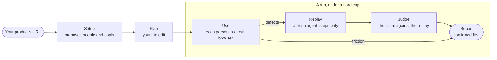
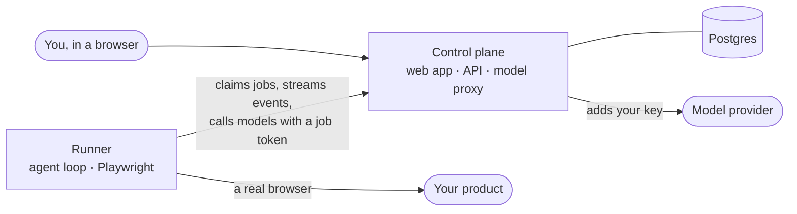

<p align="center">
  <a href="https://usetrawler.com">
    
  </a>
</p>

<p align="center">
  <b>People played by AI use your real product in a real browser.<br>
  A second agent replays every defect, blind, before it reaches you.</b>
</p>

<p align="center">
  <a href="https://usetrawler.com"><b>Website</b></a>
  &nbsp;·&nbsp;
  <a href="https://app.usetrawler.com"><b>Start testing</b></a>
  &nbsp;·&nbsp;
  <a href="https://usetrawler.com/docs/"><b>Docs</b></a>
  &nbsp;·&nbsp;
  <a href="#run-it-on-your-own-machine"><b>Run it locally</b></a>
  &nbsp;·&nbsp;
  <a href="mailto:contact@usetrawler.com"><b>Contact</b></a>
</p>

<p align="center">
  <a href="https://github.com/usetrawler/trawler/actions/workflows/ci.yml"></a>
  <a href="#use-it-in-the-app"></a>
  
  <a href="#licence"></a>
</p>

## Test your product the way people use it

Paste the address of your staging or preview environment. Trawler reads the page and proposes a few **people** — each with a situation, a temperament and things they care about — and the **goals** they want to get done. Then each person uses your product in a real browser, works through the goals and reports what went wrong on the way: a **defect** when something behaved wrongly, **friction** when it worked but slowed them down.

Nothing a person reports reaches the top of your report on their word alone. Every defect goes to a fresh agent that has never seen the report: it is given the steps and nothing about what went wrong, follows them in a new browser, and says what it saw. A **judge** compares that with the claim, and only a defect the replay reproduces is **confirmed**.

## How it works

**01 · Paste a URL.** Trawler reads your product's page and, in about half a minute, proposes up to four people and six goals. Edit anything — or just start.

**02 · Meet your users.** The people take their turns in your real product: clicking, typing and navigating as they see fit, working through every goal, and reporting defects and friction with the steps that led there. No scripts, no recorded flows to maintain.

**03 · Believe the second agent.** Every defect is replayed blind — a fresh agent in a new browser gets the steps, never the claim — and a judge answers *confirmed*, *refuted* or *inconclusive*.

**04 · Act on what was confirmed.** The report opens with the defects a fresh agent reproduced, each with its steps, what the person saw and what the replay saw. The run was estimated before it started, and it stops spending at the cap you set.



## Who it is for

- **Teams with a staging or preview environment** who want to know where a first-day user gets stuck before a first-day user does.
- **Anyone who built something quickly** — a prototype, a proof of concept, a new feature — and wants it used by someone who is not its author.
- **People who would rather read five confirmed defects than fifty guesses.** A run costs a few dollars on your own model key.

It is not a scripted test suite, a load test or a security scan. The people decide how to reach each goal, one person at a time, and report what they saw in the browser — not opinions about the design.

## Your product stays yours

| | |
| --- | --- |
| **Credentials** | Test account passwords are typed by Trawler, not the model, and only into a real password field on an allowed origin. Every password and secret a run knows about is masked as `•••` in what the model reads and what the run records. |
| **Reach** | A browser limited to your product's own origins — every other request is stopped before it is sent — and a handful of tools: no shell, no file system, no uploads, no JavaScript in the page. |
| **Spend** | Estimated before you start and hard-capped during the run: $2 by default, $50 at most. |
| **Your key** | Runs in the app are billed to your workspace's own key — OpenRouter, OpenAI, Anthropic, Google or any OpenAI-compatible service. Trawler adds nothing on top, and setting up a project costs you nothing. |
| **Isolation** | The model key and passwords are encrypted at rest, runners never hold the model key, and the database itself keeps each workspace's rows from every other. |
| **Execution** | Hosted at app.usetrawler.com, or entirely on your own machine with the runner in this repository. |

The details, including what masking cannot hide, are in [Security and data](https://usetrawler.com/docs/reference/security-and-data/).

## Use it in the app

> [!NOTE]
> Hosted runs are in a private beta. Anyone can sign in, analyse a product and edit its plan; starting a run needs an email address on the beta list — write to [contact@usetrawler.com](mailto:contact@usetrawler.com).

1. **Sign in** at [app.usetrawler.com](https://app.usetrawler.com) with **Continue with GitHub** or **Continue with Google** — there are no passwords. Your first sign-in creates your workspace, unless you were invited to one.
2. **Paste your product's address** — the page a new user would open first — and, if you like, a few words to focus on, such as *the new team-invite flow*. Choose **Analyse product**.
3. **Review the plan.** The people under **These people will try it** and the goals under **What they want to get done** are yours to rename, rewrite, add to or trim. If your product needs sign-in, add a test account and choose it under **Signs in as**.
4. **Start.** The first time, an owner or admin of the workspace pastes an API key from your model provider. Pick a model (one is filled in for you), read the estimate, set the **Hard cap**, tick the box confirming that you may test this product and that it holds no real people's data, and choose **Start run**.
5. **Follow the run:** cost against the cap, goals reached and a card for each person. Close the tab if you like — the run keeps going.
6. **Read the report.** **Confirmed** comes first: the defects a fresh agent reproduced and the judge agreed with.

Screen by screen: [Your first run](https://usetrawler.com/docs/getting-started/first-run/).

## Run it on your own machine

The runner is the program that actually uses your product: it opens the browser, plays the people, replays the defects and asks the judge. The same program carries out hosted runs, and it runs just as well entirely on your machine — no Trawler account, no Trawler server — reaching whatever your machine can reach: `localhost`, a VPN, staging behind a password.

You need Node.js 24 or later and an [OpenRouter API key](https://openrouter.ai/keys); the local runner calls models through OpenRouter only.

```bash
git clone https://github.com/usetrawler/trawler.git
cd trawler
npm ci
npx playwright install chromium
export OPENROUTER_API_KEY=sk-or-...
```

On Linux, add `--with-deps` to the Playwright command so it installs the libraries Chromium needs.

**1. Propose a plan** from your product's address. Setup reads the page, writes a name, a description, up to four people and up to six goals to `project.yaml`, and prints what it wrote and what it cost, such as `wrote project.yaml: 4 personas, 5 goals, $0.004`.

```bash
npx trawler-runner setup https://staging.example.com --focus "the new team-invite flow"
```

**2. Edit `project.yaml`.** It is plain YAML: the people (`personas`), their `goals` and test `accounts`, plus what the app does not offer yet — extra `allowedOrigins`, HTTP basic auth and headers for protected staging. It holds passwords, so setup writes it readable by you alone.

```yaml
name: Acme
targetUrl: https://staging.example.com/
description: Shared workspaces for small teams.
personas:
  - id: ana
    name: Ana
    brief: You run a small bakery and have ten minutes between orders. You give up on anything that needs a manual.
    accountRef: owner
goals:
  - id: invite-teammate
    instruction: Invite a teammate to your workspace.
accounts:
  - ref: owner
    username: ana@example.com
    password: a-long-test-password
httpCredentials:
  username: staging
  password: the-staging-password
```

**3. Run it.** Every person takes a session in turn, then every defect is replayed and judged, all under one budget.

```bash
npx trawler-runner run --config project.yaml
```

Progress streams to the terminal — `role:ana started`, `role:ana found a defect: …`, `judge:f1 confirmed` — and the run is written to `runs/<start time, UTC>/`:

| File | |
| --- | --- |
| `report.md` | The cost against the budget, a table of the sessions, replays and judge calls, each person's goals, then the defects grouped as confirmed, inconclusive, refuted and not judged, and the friction |
| `summary.json` | The same results as data |
| `events.jsonl` | Everything that happened, one event per line, written as it happens |

A confirmed defect in `report.md` reads like this:

```markdown
### Inviting a teammate fails with "Permission denied"
defect, high, ana / invite-teammate

After choosing Send invite the page says "Permission denied", and Members still lists only Ana.

1. Open https://staging.example.com/settings/members
2. Click "Invite teammate"
3. Type teammate@example.com into the Email field
4. Click "Send invite"

Replay: carried out every step. After "Send invite" a red banner reads "Permission denied"; the member list is unchanged.
```

| `run` option | Default | |
| --- | --- | --- |
| `--model <id>` | `deepseek/deepseek-v4.1-flash` | The OpenRouter model that plays the people and carries out the replays |
| `--judge-model <id>` | the same as `--model` | The model that judges |
| `--budget <usd>` | `5` | The cap for the whole run, in dollars, checked after every step |
| `--max-steps <n>` | `120` | Steps for each person's session |
| `--replay-steps <n>` | `40` | Steps for each replay |
| `--headed` | | Show the browser instead of running it hidden |

`setup` also takes `--docs <url>`, `--model <id>`, `--out <file>` and `--force`. The runner exits `0` when the run finished and at least one person's session did not fail, `1` when every session failed or something else went wrong, and `2` on a usage mistake, an invalid project file or a missing `OPENROUTER_API_KEY`. Model calls go from your machine to OpenRouter, asking the providers behind it not to keep or train on the data; nothing goes to Trawler.

Every field and option: [The local runner](https://usetrawler.com/docs/runner/local-runner/).

## Not built yet

So you don't go looking: comparing a run with an earlier one, people using the product together, screenshots on findings, deleting a project or a run, handing runs from the app to a runner inside your own network, and reaching staging behind basic auth or a secret header from the app — the local runner covers private addresses and protected staging today. Hosted runs stay in a private beta until Trawler can verify that you control the product you point it at. The runner is not published as a package yet; you run it from a checkout.

## Inside this repository



That is a hosted run. Run locally, the runner needs neither the control plane nor Postgres: it reads `project.yaml` and calls OpenRouter itself.

| Path | What it is | Licence |
| --- | --- | --- |
| [`apps/runner`](apps/runner) | `trawler-runner`: the people's sessions, blind replays and the judge — on your machine (`setup`, `run`) or for the hosted app (`work`) | Apache-2.0 |
| [`packages/protocol`](packages/protocol) | The zod schemas both sides share: the project file, findings, run events and the runner API | Apache-2.0 |
| [`packages/core`](packages/core) | The engine: the agent loop, the browser and its origin allowlist, secret masking, setup, replay and the judge | FSL-1.1-ALv2 |
| [`apps/control-plane`](apps/control-plane) | The app at app.usetrawler.com: sign-in, workspaces, plans, runs, the runner API and the model proxy | FSL-1.1-ALv2 |
| [`db`](db) | The Postgres schema as Flyway migrations, with row-level security per workspace | FSL-1.1-ALv2 |
| [`scripts/release`](scripts/release) | Releases: staging, a smoke check, then production | FSL-1.1-ALv2 |

Built with TypeScript on Node.js 24, Next.js, Postgres with Flyway and Kysely, Better Auth, the Vercel AI SDK with Playwright MCP, zod and Vitest.

## Development

You need Node.js 24 or later, and Docker, which runs Postgres 18 and Flyway for the database tests.

```bash
npm ci
npx playwright install chromium
npm run typecheck
npm run test:unit
npm run db:up
npm test
```

`npm run test:unit` runs the tests that need no database; `npm test` runs them all, once `npm run db:up` has started Postgres on `localhost:54329`. Every pull request runs the same checks in CI, plus the migrations, the generated database types and the control plane's production build.

| Command | |
| --- | --- |
| `npm run db:migrate`, `npm run db:validate` | Apply or check `db/migrations` on the local database |
| `npm run db:codegen` | Regenerate `apps/control-plane/src/db/types.ts` from the migrations |
| `npm run db:down` | Stop the local database |
| `npm run control-plane` | Start the app in development; it reads its configuration from the environment, in [`env.ts`](apps/control-plane/src/server/env.ts) |

## Licence

`apps/runner` and `packages/protocol` are [Apache-2.0](LICENSE-APACHE). Everything else is [FSL-1.1-ALv2](LICENSE-FSL), the Functional Source License: use, change and redistribute it for any purpose except offering it to others in a competing commercial product or service. Each release becomes Apache-2.0 two years after it is made available.

---

<p align="center">
  <b>Find what your users find first.</b><br>
  <a href="https://app.usetrawler.com">Start testing</a>
  &nbsp;·&nbsp;
  <a href="mailto:contact@usetrawler.com">contact@usetrawler.com</a>
</p>
